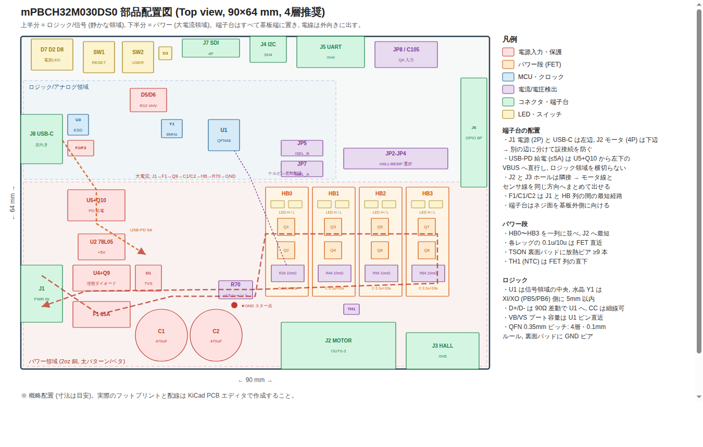

# mPBCH32M030DS0 — CH32M030 ユニバーサル・モータードライバ基板

WCH **CH32M030C8U7 (QFN48)** と東芝 **TPN1R603PL** ×8 で、次のモータを 1 枚で駆動する基板です。
USB-C から ESP32-C3 / Arduino のように書き込めて、**USB-PD 充電器 (9〜15V) だけでもモーターを回せます**。
内蔵の電流源・USB-PD・OPA/CMP を使い切る設計です ([内蔵機能の活用検討](docs/advanced_features.md))。

| 駆動対象 | 使うハーフブリッジ | J2 モータ端子 | JP5 |
|---|---|---|---|
| 3 相モータ (BLDC/PMSM, ホール or センサレス) | HB0〜HB2 (TIM1) | U=1, V=2, W=3 | 1-2 (センサレス 6 ステップは JP7=2-3) |
| フルブリッジ DC ×1 | HB0/HB1 (TIM1) | 1-2 | — |
| フルブリッジ DC ×2 | + HB2/HB3 (TIM2) | 1-2 と 3-4 | 2-3 |
| バイポーラ・ステッピング | A = HB0/HB1, B = HB2/HB3 | A+=1 A-=2 B+=3 B-=4 | 2-3 |

> **ステータス: Rev 0.2 回路図 (未試作)**。PCB は `hardware/wip` の作業途中データから続けて作成してください。
> 無保証です (LICENSE)。モーター駆動は大電流を扱います。電流制限付き電源で段階的に確認してください。



## リポジトリ構成

| パス | 内容 |
|---|---|
| `hardware/mPBCH32M030DS0.kicad_sch` | **KiCad 回路図** (トップ + 5 サブシート: 電源 / USB・水晶・リセット / MCU / パワー段 / I/O) |
| `hardware/lib/` | フットプリント `CH32M030DS0_QFN48` (作業途中データから抽出) とシンボル `mdrv.kicad_sym` |
| `hardware/bom.csv` | 部品表 (161 点) |
| `hardware/gen_schematic.py` | 回路図の生成元 (回路の正)。`verify_netlist.py` で KiCad の解釈と照合 (102/102 ネット一致) |
| `hardware/wip/` | 作業途中の元データ (KiCad 8)。レビュー結果は [docs/design.md §3](docs/design.md#3-作業途中データ-hardwarewip-のレビュー結果) |
| `docs/schematic.pdf` | 回路図 PDF |
| `docs/placement.svg` | 部品配置図 (端子台の配置・大電流ループ・ゾーン) |
| `docs/design.md` | **部品選定の妥当性と設計根拠** (データシート値) |
| `docs/advanced_features.md` | **内蔵機能 (電流源/シンク・USB-PD・OPA/CMP 全モード) の活用検討と Rev 0.2 の変更点** |
| `firmware/bootloader/` | USB/UART ブートローダ (WCH IAP 互換, 20KB) |
| `firmware/app_template/` | Arduino 風テンプレート (`setup()` / `loop()`) + ボード支援ライブラリ `mpb.h` (PD, 過電流, BEMF, ホール, タコ, NTC, 自己診断) |
| `tools/mpb_upload.py` | 書き込みツール (USB / UART, Windows・macOS・Linux) |

## 仕様

- 入力: **J1 端子台 8〜16V (公称 12V)** / **USB-C PD 9〜15V (≤5A)** — 理想ダイオード OR で同時接続も安全。USB 5V のみでも MCU と書き込みは動作
- 出力: 4 ハーフブリッジ, 10A 連続 / 20A ピーク (放熱次第), PWM 16〜20kHz
- MCU: CH32M030C8U7, RISC-V 72MHz, 8MHz 水晶
- 保護: 逆接続・逆流 (理想ダイオード), 15A ヒューズ, TVS, ハードウェア過電流遮断 (25.4A / DAC 可変), 過電圧リセット (18V), 過熱, 結線自己診断
- インターフェース: USB-C (USB2.0 FS + PD シンク), I2C (Qwiic), UART, 1 線 SDI, GPIO ×2 + タコ入力 + nFAULT, ホール ×3
- センシング: 電流 3ch, センサレス BEMF (CMP3 + 内部仮想中性点), ホール XOR (TIM2), タコ / 電流リップル (QII1 → TIM3), NTC

## 結線まとめ (ご要望の項目)

### USB Type-C (J8, GCT USB4105) — PD と D+/D-

| J8 ピン | ネット | 接続先 |
|---|---|---|
| A4/A9/B4/B9 VBUS | USB_VBUS | F2 (PTC 0.5A) → D6 → VHV (MCU 電源)<br>**F3 5A → U5 LM74700 + Q10 → VBUS (モーター電源, PD 契約後に PC3 で許可)**<br>120k/10k → **PA2 (USB VBUS 監視)** |
| A5 CC1 / B5 CC2 | USB_CC1 / USB_CC2 | **PA0 (CC1R) / PA1 (CC2R)** = PD0: Type-C Rd 5.1kΩ 内蔵。**PD シンクとして 8〜15V の固定 PDO を交渉** (`Mpb_PD_*`) |
| A6/B6 D+ | USB_DP | U3 IO1 (ESD, 基準 +3V3) → **PB0 (UDP)** |
| A7/B7 D- | USB_DN | U3 IO2 → **PB1 (UDM)** |
| A1/A12/B1/B12 GND | GND | |
| S1 シールド | USB_SHIELD | 1MΩ ‖ 4.7nF → GND |
| A8/B8 SBU | — | 未接続 |

### リセット / 操作

| 部品 | 接続 | 備考 |
|---|---|---|
| SW1 RESET | PC0 (RST) — 10k プルアップ + 0.1µF | RST ピンはオプションバイトで有効化 (RST_PIN_SEL=0) |
| SW2 USER/BOOT | PC4 — 10k プルアップ | 押しながらリセット → ブートローダ。**状態 LED D3 と共用** (PC4 Low で点灯) |

### 電源供給端子と端子台の配置

| 端子 | 位置 | 内容 |
|---|---|---|
| **J1** PWR IN (5.08mm 2P) | **左辺** | VIN / GND → F1 15A → TVS → 470µF×2 → VBUS。GND 側に逆接保護 Q9 |
| **J2** MOTOR (5.08mm 4P) | **下辺** | OUT0〜OUT3 (HB0〜HB3 直結) |
| J3 HALL (XH 5P) | 下辺 (J2 の隣) | +5V / GND / A / B / C。モータ線とセンサ線を同じ方向へ |
| J8 USB-C (PD 9〜15V) | 左辺 (J1 の上) | PD 給電は U5+Q10 から VBUS へ直行 (ロジック領域を横切らない) |
| J6 GPIO (2.54mm 8P) | 右辺 | GND / 3V3 / PC4 / PC5 / TACH_IN / nFAULT / 5V / GND |

J1 と J2 は別の辺に置いて誤接続を防ぎ、J1 → バルク容量 → ハーフブリッジ列 → シャント → Q9 → J1 の
大電流ループを基板下半分で最短にしています (docs/placement.svg)。

### 電源確認 LED / ゲート確認 LED

| LED | 接続 | 意味 |
|---|---|---|
| D7 赤 | VBUS – 10k | モータ電源あり |
| D2 緑 | +5V – 2.2k | 5V (78L05) |
| **D8 緑** | **+3V3 (VDD33) – 1.5k** | **MCU 電源 (内蔵 LDO 出力)** |
| D3 緑 | +3V3 – LED – 1k – PC4 (Low で点灯) | 状態 (ブートローダ中は高速点滅, PD 給電中も速い点滅) |
| **D10〜D17** | 各 HB の **GHx–SWx (赤, H)** / **GLx–SRCx (緑, L)** – 22k | **ゲート ON 表示** (PWM デューティで明るさが変わる) |

### シャント抵抗による電流測定 (内蔵 ADC)

| チャネル | シャント | 経路 → ADC |
|---|---|---|
| IA | R34 10mΩ (HB0) | ISP1/ISN1 → OPA3 (差動, ゲイン 4/8/16/55) → **ADC IN9** |
| IB | R44 (HB1) / R54 (HB2) を JP5 で選択 | ISP2/ISN2 → OPA4 → **ADC IN10** |
| IBUS | R70 10mΩ (全レッグの帰路) | PB3 → **ADC IN1** (直接) + CMP3 → TIM1 ブレーキ |

電圧: VBUS (PB4, IN17), USB VBUS (PA2, IN15), 相電圧 U/V (PA5/PA7), 温度 NTC (PA4, ISOURCE1)。
IA は JP7 で HB0 レッグ / バス電流を切り替えられ、CMP2 + 内蔵 DAC でサイクル毎の電流制限にも使えます。詳細は [docs/design.md §2.3](docs/design.md#23-電流電圧の計測-内蔵-adc)。

### 水晶

Y1 8MHz (3225, CL=20pF) — **PB5 (XI) / PB6 (XO)**, 30pF ×2 → GND。帰還抵抗は内蔵。

### 残りの GPIO の引き出し (J6)

| ピン | 機能 |
|---|---|
| PC4 | GPIO / TIM1_CH2_3 / SPI_MISO (USER/BOOT ボタン + 状態 LED 兼用, 例: DIR) |
| PC5 | **HV I/O** (VHV 系, 入力耐圧 VHV+6V) — 12V 系の EN / リミットスイッチに |
| TACH_IN | R123 → JP8 → C105 → PA12 (QII1: OPA1 → CMP1 → TIM3 CH1)。ファン FG / VR センサ等の周期計測 |
| nFAULT | PA13 = TIM1_BKIN_1 (Low で全ゲート OFF) |

Rev 0.2 では PC3 (PD 給電許可) と PA6 (W 相センシング) を内蔵機能に割り当てたため、引き出し GPIO は減っています
(理由は [docs/advanced_features.md](docs/advanced_features.md))。ジャンパを外せば、JP2〜JP4 の中央ピン (PA5/PA6/PA7) も使えます。

## CH32M030C8U7 ピン割当 (QFN48)

| ピン | 名称 | 用途 | ピン | 名称 | 用途 |
|---|---|---|---|---|---|
| 1 | PA12 | QII_IN (OPA1→CMP1→TIM3) | 25 | PB15 | HO3 (TIM2_CH2) |
| 2 | PA13 | nFAULT (TIM1_BKIN_1) | 26 | VDD8 | 10µF+0.1µF |
| 3 | PA14 | I2C SDA (リマップ2) | 27 | PC0 | RST |
| 4 | PA15 | I2C SCL (リマップ2) | 28 | PC1 | UART TX |
| 5 | PB2 | OCP_REF (CMP3_N3) | 29 | PC2 | UART RX (リマップ1) |
| 6 | PB3 | IBUS (CMP3_P3, ADC1) | 30 | PC3 | PD_PWR_EN (USB 給電許可) |
| 7 | PB4 | VBUS 監視 / OVP | 31 | PC4 | USER/BOOT + 状態 LED, GPIO (J6) |
| 8 | PB5 | XI | 32 | PC5 | HV I/O (J6) |
| 9 | PB6 | XO | 33 | VDD33 | 4.7µF+0.1µF |
| 10 | PB8 | LO0 (TIM1_CH1N) | 34 | VHV | 10µF+0.1µF |
| 11/12 | VS0/VB0 | HB0 ブート | 35 | PA0 | USB CC1 |
| 13 | PB9 | HO0 (TIM1_CH1) | 36 | PA1 | USB CC2 |
| 14 | PB10 | LO1 (TIM1_CH2N) | 37 | PA2 | USB VBUS 監視 (ADC15) |
| 15/16 | VS1/VB1 | HB1 ブート | 38 | PA3 | SWDIO |
| 17 | PB11 | HO1 (TIM1_CH2) | 39 | PB0 | USB D+ |
| 18 | PB12 | LO2 (TIM1_CH3N / TIM2_CH1N) | 40 | PB1 | USB D- |
| 19/20 | VS2/VB2 | HB2 ブート | 41 | PA4 | NTC (ISOURCE1) |
| 21 | PB13 | HO2 (TIM1_CH3 / TIM2_CH1) | 42 | PA5 | SENS_U (ADC6) |
| 22 | PB14 | LO3 (TIM2_CH2N) | 43 | PA6 | SENS_W (CMP3_N1, TIM2_CH2) |
| 23/24 | VS3/VB3 | HB3 ブート | 44 | PA7 | SENS_V (ADC2) |
| | | | 45 | PA8 | ISN1 |
| | | | 46 | ISP1 | 電流 A |
| | | | 47 | PA10 | ISP2 電流 B |
| | | | 48 | PA11 | ISN2 |
| | | | EP (49) | GND | 裏面パッド |

## ブートローダとファームウェア書き込み (USB-C)

### 選定: WCH 公式 IAP を基板向けに改造したもの

CH32M030 は工場出荷のシステムブートローダ (USB ISP) を持たないため (RM 19.1 のメモリマップに BOOT 領域が無い)、
ユーザー領域の先頭 20KB にブートローダを置きます。WCH 公式 EVT の `UART_USB_IAP` (CH32M030 専用) を土台にしました。

| 比較 | WCH IAP 改 (採用) | 独自 USB DFU / CDC | ch32fun USB ブートローダ |
|---|---|---|---|
| CH32M030 対応 | ◎ 公式サンプルが専用 | 自作が必要 | ✕ 未対応 (CH32X035/CH570 のみ) |
| 実績・保守 | ◎ WCH 提供 | △ | — |
| ホストツール | 本リポジトリの `mpb_upload.py` (全 OS) + WCH 純正 WinAPP | dfu-util 等 | minichlink |
| サイズ | 5.7KB | — | — |

改造点: 起動条件 (アプリ無し / アプリからの要求 / USER・BOOT ボタン)、UART を PC1/PC2 へ、状態 LED 点滅、
USB bcdDevice でアプリ (0xA001) とブートローダ (0xB001) を区別。

**フラッシュ配置**: `0x08000000` ブートローダ (20KB) / `0x08005000` アプリ (44KB−128B) / `0x0800FF80` 要求フラグ

### 使い方 (Arduino / ESP32 と同じ流れ)

```bash
# 0) ツール (Ubuntu の例)
sudo apt install gcc-riscv64-unknown-elf picolibc-riscv64-unknown-elf libusb-1.0-0
pip install pyusb pyserial
sudo cp tools/99-mpb.rules /etc/udev/rules.d/    # root なしで USB を開く

# 1) SDK を取得してビルド
cd firmware && ./sdk/fetch_sdk.sh
make -C bootloader          # → bootloader/build/mpb_bootloader.hex
make -C app_template        # → app_template/build/app.bin

# 2) 【初回のみ】ブートローダを WCH-LinkE (J7: 1 線 SDI = SWIO/RST/GND) で書き込む
#    J1 に 12V を給電 (SWD には VHV ≥ 5V が必要)。WCH-Link から 3.3V は供給しない。
#    WCH-LinkUtility (Windows) か MounRiver Studio で mpb_bootloader.hex を 0x08000000 へ
#    (wlink が CH32M030 に対応していれば: make -C bootloader flash)

# 3) 以降は USB-C だけで書き込み (アプリ実行中でも自動でブートローダへ切り替わる)
make -C app_template upload
#    = python3 tools/mpb_upload.py app_template/build/app.bin
```

- スケッチは `firmware/app_template/src/sketch.c` の `setup()` / `loop()` に書く (Arduino の .ino 相当)。
- `main.c` が USB/UART の書き込み要求を常に受け付けるので、「Upload」だけで書き換わる (ESP32 / Arduino の自動リセット相当)。
- アプリが暴走して応答しない時は **SW2 (USER/BOOT) を押しながら SW1 (RESET)** → 状態 LED が高速点滅 → 書き込み可能。
- USB だけの給電でも MCU とブートローダは動作する (VHV ≈ 4.5V)。モーター駆動には J1 の 12V か、PD 充電器 (9〜15V) が必要。
- Windows: pyusb 用に Zadig で WinUSB を 1A86:55E0 に割り当てる。WCH 純正の `WCHMcuIAP_WinAPP.exe` も同じプロトコルで使える。
- UART 書き込み: `python3 tools/mpb_upload.py --uart COM3 app.bin` (J5, 460800bps, 先に BOOT ボタンでブートローダを起動)。

### 検証状況

| 項目 | 状態 |
|---|---|
| 回路図の接続 | `kicad-cli` のネットリストと設計値が **102/102 ネット一致** (`verify_netlist.py`) |
| ブートローダ / アプリ | GCC 13 (riscv64-unknown-elf + picolibc) で**警告 0 でビルド** (5.7KB / 10.5KB)。アプリの `_start` = 0x5000 を確認 |
| 書き込みツール | ブートローダのプロトコル処理 (`RecData_Deal` / `UART_Rx_Deal`) を Python で再現したシミュレータで**書込・検証が一致** (`tools/test_mpb_upload.py`, 1B〜44KB) |
| 実機 | **未確認** (基板未製作) |

## ファームウェア開発の注意

- TIM1 (HB0〜HB2) と TIM2 (HB2/HB3 リマップ2) を同時に同じピンへ出さないこと (PB12/PB13 は両方の候補)。
- デッドタイム初期値 0.5µs, PWM 16〜20kHz から始め、ゲート確認 LED とオシロで確認する。
- 過電流: CMP3 (IBUS) / CMP2 (OPA3+DAC) → TIM1 BKIN。BKIN の無い TIM2 は `OPA_IRQHandler` (mpb_analog.c) が停止し、HB2/HB3 のゲートを Low に固定する。
- VDD8 は `PWR_VDD8_Config()` で VIN に合わせて選択 (VIN ≥ 12V → 10V)。
- ゲートを駆動する前に VBUS ≥ 8V を ADC で確認する (USB のみ給電時は駆動しない)。
- `loop()` は Delay で止めない (USB-PD の処理は 1ms 周期で `Mpb_PD_Task()` を呼ぶ必要がある)。
- 起動時に `Mpb_SelfTest_Wiring()` でモーターの接続を確認してからパワー段を有効にすると安全。

## ライセンス

- **個人利用は自由 (クレジット表示必須)**: 「mPBCH32M030DS0 by ghostinkoma」とリポジトリ URL を表示
- **商用利用は作者へ連絡**: sinhex.k@gmail.com
- **一切無保証**
- 詳細は [LICENSE](LICENSE)、第三者の著作物 (WCH SDK 由来コード等) は [NOTICE](NOTICE)

## 参考

- WCH CH32M030 データシート / リファレンスマニュアル: https://www.wch-ic.com/products/CH32M030.html
- WCH 公式 EVT (SDK, IAP サンプル, 評価ボード回路図): https://github.com/openwch/ch32m030
- 東芝 TPN1R603PL: https://toshiba.semicon-storage.com/us/semiconductor/product/mosfets/12v-300v-mosfets/detail.TPN1R603PL.html
